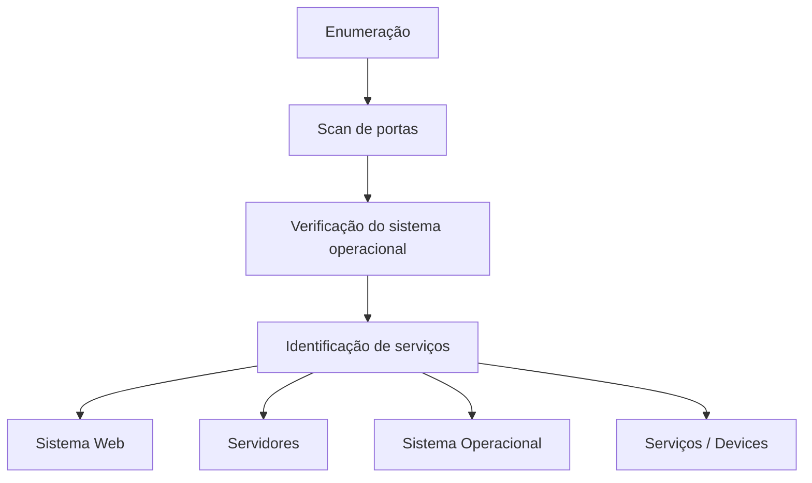

## enumeração

a Enumeração de redes é o processo de coletar informações detalhadas sobre os dispositivos, serviços e configurações presentes em uma rede. A ideia é mapear tudo que está acessível, como:

- Hosts ativos (quais máquinas estão ligadas e respondendo);
- Portas abertas e protocolos em uso;
- Serviços executando e suas versões;
- Informações de sistemas operacionais;
- Configurações de compartilhamento, regras e permissões

### tipos de enumeração

- **enumeração de unix/linux**: listar usuários, grupos, senhas, serviços em execução
- **enumeração de Windows**: listar usuários, grupos, senhas, serviços em execução
- **enumeração de rede**: listar hosts ativos, portas abertas, serviços em execução

### técnicas de enumeração

- **extrair username a apartir de id de emails**: usar scripts para obter nomes de usuários a partir de endereços de email
- **extrair informações através de senhas**: usar ferramentas para descobrir senhas fracas ou padrões
- **diretorio ativo de brute force**: tentar várias combinações de usuário e senha para acessar contas
- **descobrir grupos de usuários**: identificar grupos e suas permissões
- **extrair informações por DNS**: consultar registros DNS para obter informações sobre a rede

### diagrama de enumeração

### informações obtidas

- **redes de origem**
- **Usúarios e grupos**
- **tabela de roteamento**
- **configurações de auditoria**
- **configurações de serviços**
- **nome da maquina**
- **aplicações instaladas**
- **banners**
- **detalhes de SNMP**
- **detalhes de DNS**

### ferramentas usadas:

- **nmap**
- **netcat**
- **NBTScan**
- **Dumpsec**
- **SMBScanner**

### atividade prática

ao fazer o comando  ``nmap -v -O 192.168.100.180``  foi possível obter as seguintes informações: 
que mostra o sistema operacional como linux, portas abertas e serviços em execução.

já o comando ``nmap -v -A 192.168.100.180`` que mostará mais detalhes sobre as portas e serviços, como por exemplo:

PORT|STATE|SERVICE|VERSION
---|---|---|---
80/tcp|open |http|Apache httpd 2.2.8 ((Ubuntu) DAV/2)
3306/tcp|open |mysql|MySQL 5.0.51a-3ubuntu57-log
21/tcp|open |ftp | vsftpd 2.3.4

#### automatização de enumeração com nmap

nmap NSE é uma poderosa funcionalidade do Nmap que permite a automação de tarefas de enumeração e exploração usando scripts. Esses scripts podem ser usados para coletar informações detalhadas sobre alvos, identificar vulnerabilidades e realizar várias outras tarefas de segurança.

quando rodou o comando nmap ``-Pn -sS  -sC --script exploit scanme.nmap.org`` foi possível obter as seguintes informações: 

onde mostra as portas abertas, serviços em execução e possíveis vulnerabilidades. usando scripts padrão do nmap exploit para identificar falhas de segurança conhecidas.

já o ``nmap -p 80 --script dns-brute.nse nmap.org `` foi possível fazer uma enumeração DNS brute-force no domínio nmap.org, revelando subdomínios e outras informações relacionadas ao DNS.
