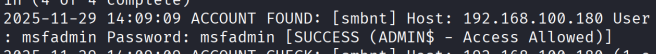

# prática
vamos simular um servidor FTP vulnerável antigo para verificar se tem falhas de segurança.
## Passo 1 - Configurar o ambiente
vamos usar o Kali Linux junto com o metasploitable 2 que é uma máquina virtual vulnerável.
- Baixe o Kali Linux: https://www.Kali.org/get-Kali/
- Baixe o metasploitable 2: https://sourceforge.net/projects/metasploitable/files/Metasploitable2/
- instale ambos em uma máquina virtual (ex: virtualbox ou vmware)
- Configure ambas as máquinas virtuais para usar a rede interna (host-only) para que elas possam se comunicar entre si.
## Passo 2 - comandos iniciais
- Inicie o Kali Linux e o metasploitable 2.
- no Metasploitabe 2, faça login com o usuário "msfadmin" e a senha "msfadmin".
- coloque `ìfconfig` no terminal do Metasploitabe 2 para descobrir o endereço IP da máquina.
- Anote o endereço IP do Metasploitabe 2 (ex:192.168.56.101).
- No Kali Linux, faça login com o usuário "Kali" e a senha "Kali".
- coloque `ping -c 3 [ip do Metasploitabe 2]` no terminal do Kali Linux para verificar se a conexão entre as máquinas está funcionando.
- Se você receber respostas, a conexão está funcionando corretamente.
## Passo 3 - Escaneando a máquina vulnerável
- No Kali Linux, abra o terminal e digite o comando `nmap -sV [ip do Metasploitabe 2]` para escanear as portas abertas e os serviços em execução.
- Anote as portas abertas e os serviços em execução.

as portas abertas são:
port| status | service| version
----|--------|--------|--------
21  | open   | ftp    | vsftpd 2.3.4
22  | open   | ssh    | OpenSSH 4.7p1 Debian 8ubuntu1 (protocol 2.0)
23  | open   | http   | Apache httpd 2.2.8 ((Ubuntu) DAV/2)
## Passo 4 - criação do dicionário
- no Kali Linux, coloque o comando ``echo -e "user\nmsfadmin\nadmin\nroot" > users.txt`` para criar um arquivo chamado users.txt com uma lista de nomes de usuário comuns. 
- coloque o comando `echo -e "123456\npassword\nqwerty\nmsfadmin" > passwords.txt` para criar um arquivo chamado passwords.txt com uma lista de senhas comuns.
- agora você tem dois arquivos: users.txt e passwords.txt que serão usados para o ataque de força bruta.
## Passo 5 - Ataque de força bruta com medusa
- No Kali Linux, digite o comando `medusa -h [ip do Metasploitabe 2] -U users.txt -P passwords.txt -M ftp` para iniciar o ataque de força bruta no serviço FTP.
- Aguarde enquanto o medusa tenta combinar os nomes de usuário e senhas do dicionário.
- Se o ataque for bem-sucedido, você verá uma mensagem indicando o nome de usuário e a senha corretos.

## Passo 6 - ataque de força bruta em sistema web
- No Kali Linux, entre no navegador e digite o endereço `http://[ip do Metasploitabe 2]/dvwa/login.php` para acessar a página web do Metasploitabe 2.
- Faça login com primeiramente com o usuário e senha incorretos para verificar a mensagem de erro. logo após entre no modo desenvolvedor do navegador (F12) e vá até a aba rede (network).
- neste ponto, você verá a requisição POST feita ao servidor quando você tenta fazer login. quando entrar no post , você verá os parâmetros enviados, como "username" e "password".
- no Kali Linux coloque `medusa -h [ip do Metasploitabe 2] -U users.txt -P  pass.txt -M http \ -m  PAGE:'/dvwa/login.php' \
-m FORM:'username=^USER^&password=^PASS^&Login=Login' \
-m 'FAIL=Login failed' -t 6
` para iniciar o ataque de força bruta na página de login do DVWA.
- ele tentará combinar os nomes de usuário e senhas do dicionário até encontrar a combinação correta. 
> **obs**: ele poderá mostar varias tentativas bem-sucedidas, mas a correta será aquela que não retornar a mensagem de falha de login.
## enumeração em spring em serviço SMB
antes de tudo, precimamos saber o que é SMB:

SMB (Server Message Block) é um protocolo de rede usado para compartilhamento de arquivos, impressoras e outros recursos em redes locais. Ele permite que os computadores se comuniquem e acessem recursos compartilhados de forma eficiente.

nesse cenario, vamos fazer que eu acessei uma rede interna e quero ver se tem algum serviço SMB vulnerável.
agora, vamos descobrir os usuários e  testar senhas para varios usuários no sistema.

vamos fazer isso através do password spraying, que é uma técnica onde tentamos uma senha comum em vários usuários diferentes, ao invés de tentar várias senhas em um único usuário. (isso ajuda a evitar bloqueios de conta que podem ocorrer com ataques de força bruta tradicionais).
- no Kali Linux, coloque o comando `enum4linux -a [ip do Metasploitabe 2]| enum4_output.txt`.  o -a vai fazer uma varredura completa., já o | enum4_output.txt vai salvar a saída em um arquivo chamado enum4_output.txt para análise posterior.
- após a enumeração, abra o arquivo enum4_output.txt e procure por nomes de usuários listados na seção "Users".
- crie um arquivo chamado smb_users.txt e adicione os nomes de usuários encontrados na enumeração.
- agora, crie um arquivo chamado smb_passwords.txt e adicione senhas comuns que você deseja testar.
- no Kali Linux, coloque o comando `medusa -h [ip do Metasploitabe 2] -U smb_users.txt -P smb_passwords.txt -M smb` para iniciar o ataque de password spraying no serviço SMB do Metasploitabe 2.
- aguarde enquanto o medusa tenta combinar os nomes de usuário e senhas do dicionário.
- se o ataque for bem-sucedido, você verá uma mensagem indicando o nome de usuário e a senha corretos.

- agora vamos verificar se conseguimos acessar o compartilhamento SMB com as credenciais obtidas.
- no Kali Linux, coloque o comando `smbclient -L //[ip do Metasploitabe 2] -U [usuário]` para listar os compartilhamentos disponíveis no serviço SMB.
